# 포토이즘 헬퍼 · 진단 프로세스 다이어그램

이 문서는 조치 프로세스(증상별 단계·분기)를 다이어그램으로 보여줍니다.
깃허브에서 이 파일을 열면 자동으로 그림으로 렌더링됩니다.
수정하려면 오른쪽 위 연필(✏️) 아이콘을 눌러 텍스트를 고치고 저장하면 됩니다.

## 목차

- [💡 에스라이트](#에스라이트)
  - [ES-1 · 촬영 시 발광 안됨](#es-1)
  - [ES-2 · 자체 불빛이 안 들어옴](#es-2)
- [🔦 지속광](#지속광)
  - [CL-1 · 빠른 속도로 깜빡거림](#cl-1)
  - [CL-2 · 자체가 안 들어옴](#cl-2)
- [📷 카메라](#카메라)
  - [CAM-1 · 카메라 자체 에러코드 발생](#cam-1)
  - [CAM-2 · 촬영 도중 카메라 에러 문구 발생](#cam-2)
  - [CAM-3 · 촬영 직전 or 도중 카메라 통신오류 발생](#cam-3)
  - [CAM-4 · 고속 연사 촬영 되는 증상](#cam-4)
  - [CAM-5 · 촬영 시 저장 실패 문구 발생](#cam-5)
  - [CAM-6 · 촬영 화면 절반에 검은 사선 발생](#cam-6)
  - [CAM-7 · 초점이 잡히지 않는 증상](#cam-7)
  - [CAM-8 · 카메라 색감 이상](#cam-8)
- [🖥️ 모니터](#모니터)
  - [MON-1 · 화면 송출 자체가 안되는 증상](#mon-1)
  - [MON-2 · 화면 터치가 안되는 증상](#mon-2)
  - [MON-3 · 화면 송출이 비정상적인 증상](#mon-3)
- [🖨️ 프린터](#프린터)
  - [PRT-1 · 리본오류 문구 발생](#prt-1)
  - [PRT-2 · 헤드위치 오류 문구 발생](#prt-2)
  - [PRT-8 · 커터오류 문구 발생](#prt-8)
  - [PRT-3 · 전원 차단 문구 발생](#prt-3)
  - [PRT-4 · 냉각팬 오류 문구 발생](#prt-4)
  - [PRT-5 · 출력물에 얼룩/점 발생](#prt-5)
  - [PRT-6 · 소모품(인화지·리본) 구겨짐/끊어짐](#prt-6)
  - [PRT-7 · 사진 출력 시 QR이 안 나오는 증상](#prt-7)
  - [PRT-9 · 출력물 흰색 여백 발생](#prt-9)
  - [PRT-10 · 리본 끊어진 증상](#prt-10)
  - [PRT-11 · QR인식 불가](#prt-11)
  - [PRT-12 · QR코드 기간 만료](#prt-12)
  - [PRT-13 · QR코드 미출력](#prt-13)
  - [PRT-14 · QR코드 잘림](#prt-14)
- [💻 PC](#pc)
  - [PC-1 · 부팅이 안되는 증상](#pc-1)
  - [PC-2 · 블루스크린 발생](#pc-2)
  - [PC-3 · 용량 부족](#pc-3)
- [💳 카드리더기](#카드리더기)
  - [CR-1 · 카드 결제 실패](#cr-1)
  - [CR-2 · 카드 결제수단 선택불가](#cr-2)
- [💵 지폐투입기](#지폐투입기)
  - [BILL-1 · 지폐 투입 불가](#bill-1)
  - [BILL-3 · 지폐 투입은 되나 인식이 안되는 증상](#bill-3)
  - [BILL-4 · 지폐 or 카드 걸림](#bill-4)
- [🎮 리모컨 / 서비스코인 / 설정](#리모컨--서비스코인--설정)
  - [RC-1 · 리모컨 작동 불가](#rc-1)
  - [RC-2 · 서비스코인/설정버튼 작동 불가](#rc-2)
- [🛰️ CMS](#cms)
  - [CMS-1 · CMS 잔여용지가 -1로 표시됨](#cms-1)
- [🪙 서비스코인](#서비스코인)
  - [SNAP-COIN-1 · 서비스코인/설정버튼 작동 불가](#snap-coin-1)

---


## 💡 에스라이트


### ES-1 · 촬영 시 발광 안됨

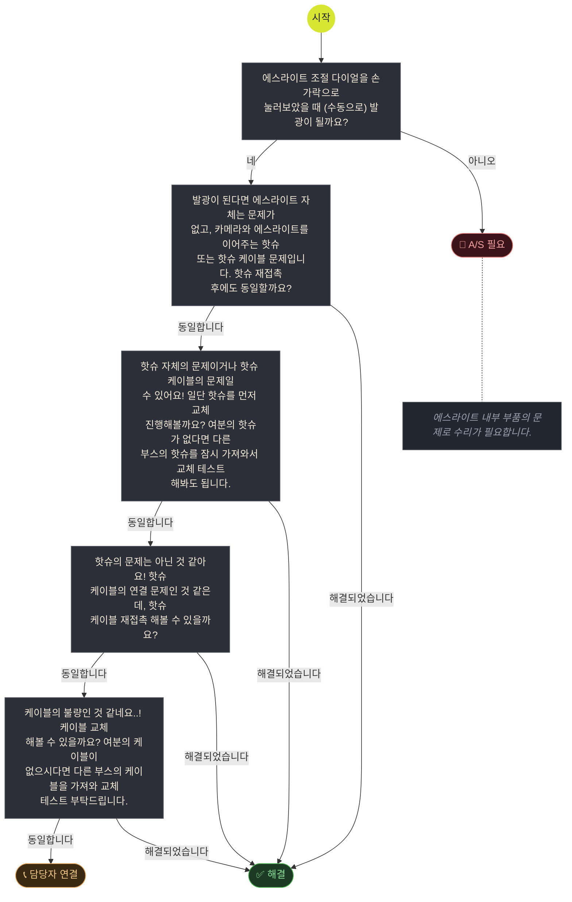


### ES-2 · 자체 불빛이 안 들어옴

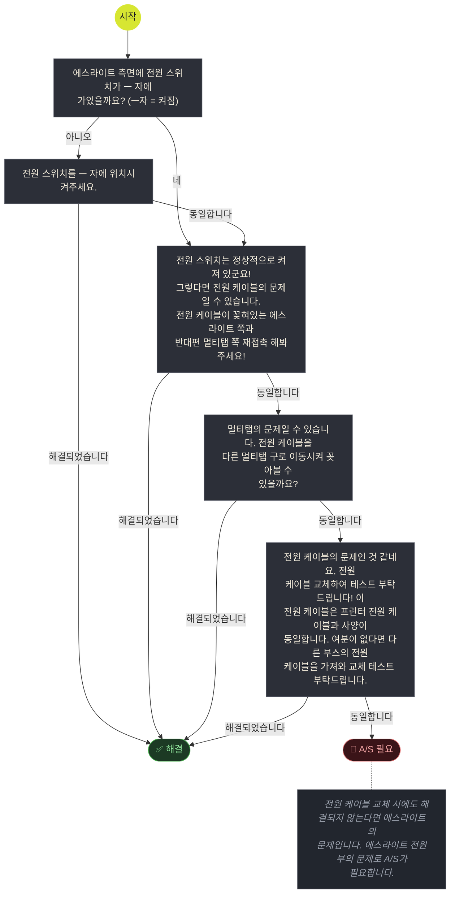


## 🔦 지속광


### CL-1 · 빠른 속도로 깜빡거림

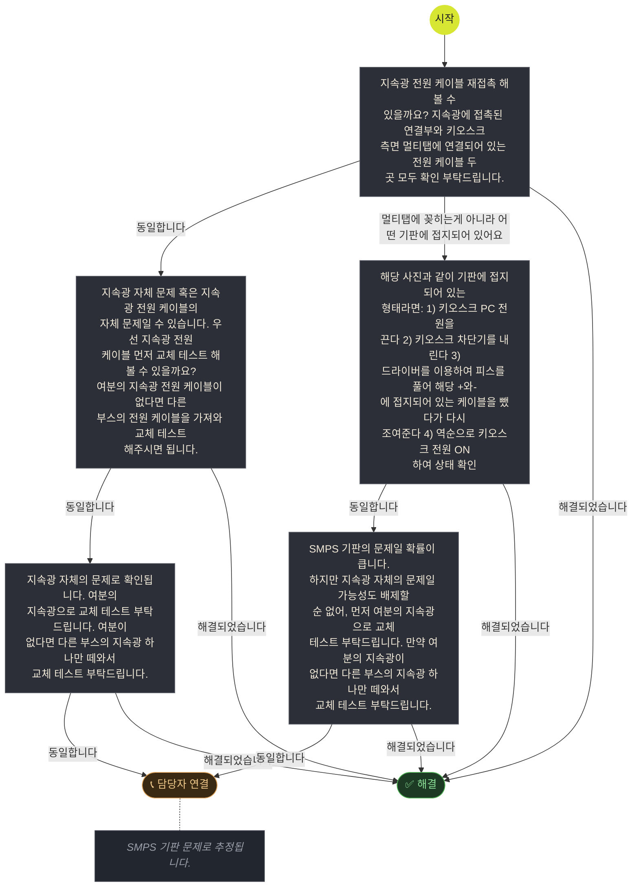


### CL-2 · 자체가 안 들어옴


## 📷 카메라


### CAM-1 · 카메라 자체 에러코드 발생

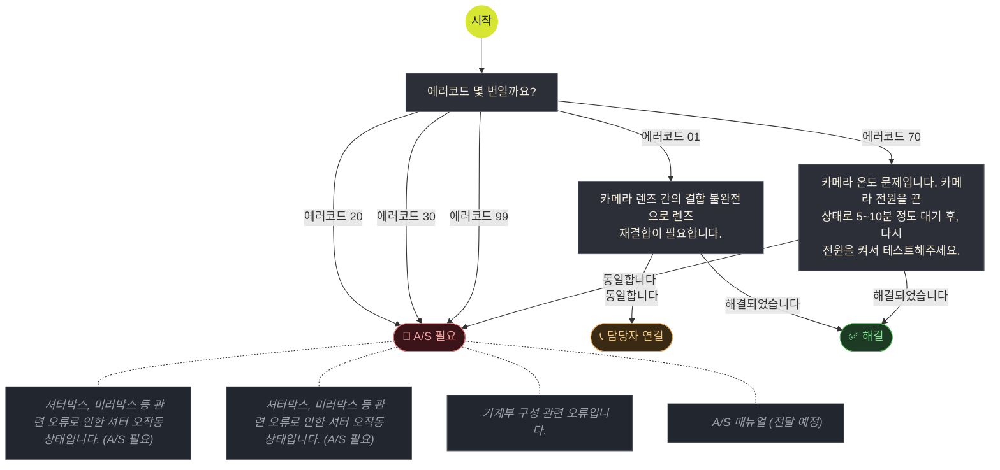


### CAM-2 · 촬영 도중 카메라 에러 문구 발생

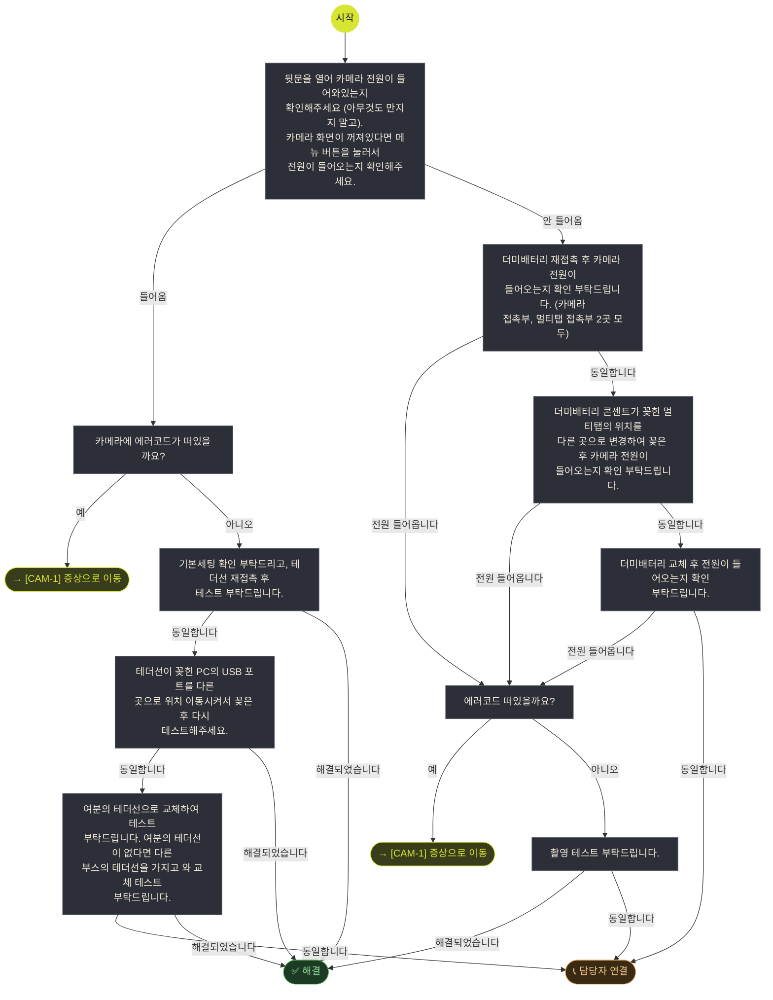


### CAM-3 · 촬영 직전 or 도중 카메라 통신오류 발생

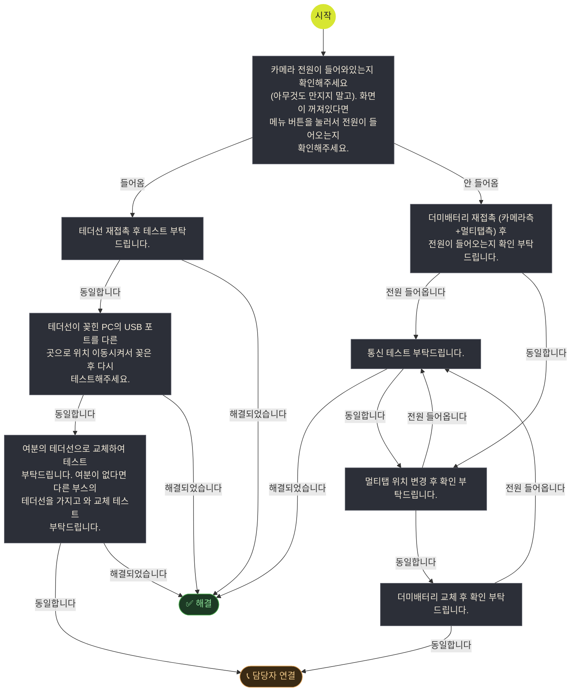


### CAM-4 · 고속 연사 촬영 되는 증상

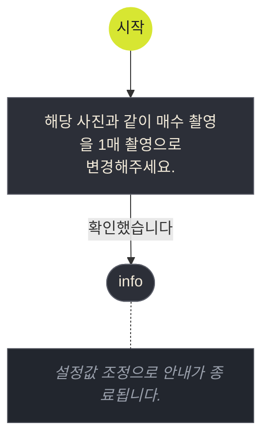


### CAM-5 · 촬영 시 저장 실패 문구 발생

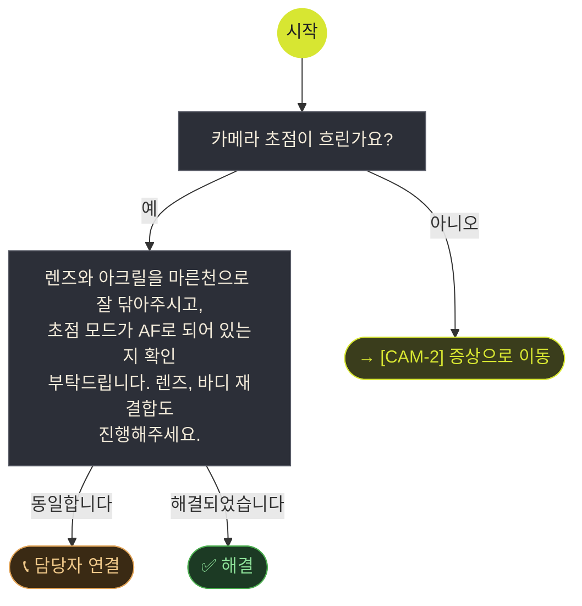


### CAM-6 · 촬영 화면 절반에 검은 사선 발생

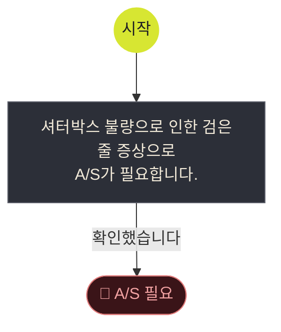


### CAM-7 · 초점이 잡히지 않는 증상

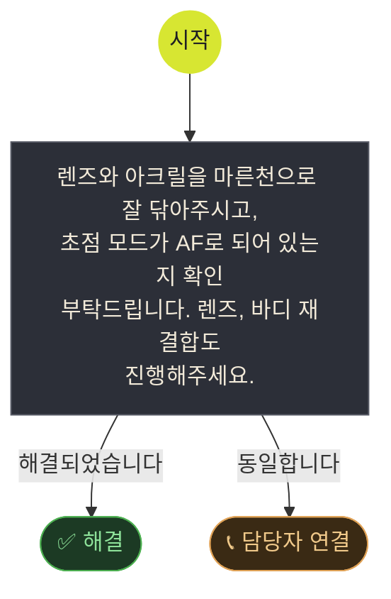


### CAM-8 · 카메라 색감 이상

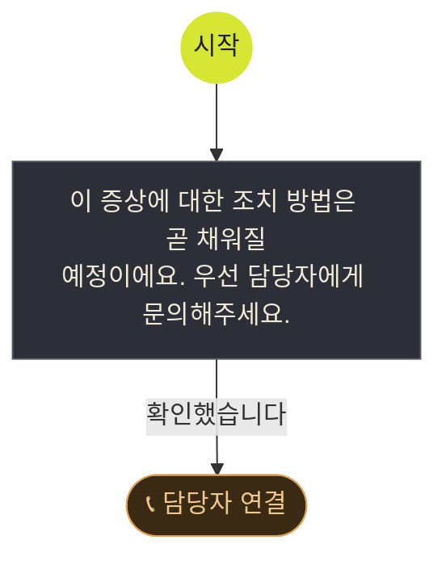


## 🖥️ 모니터


### MON-1 · 화면 송출 자체가 안되는 증상

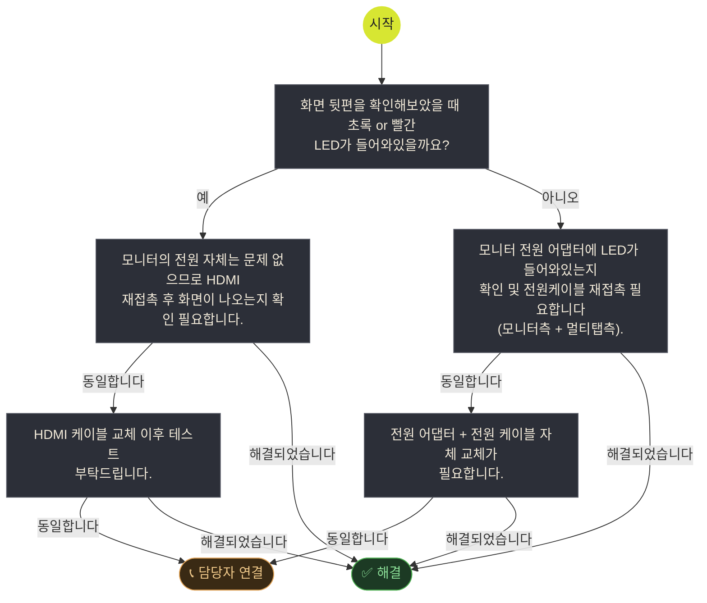


### MON-2 · 화면 터치가 안되는 증상

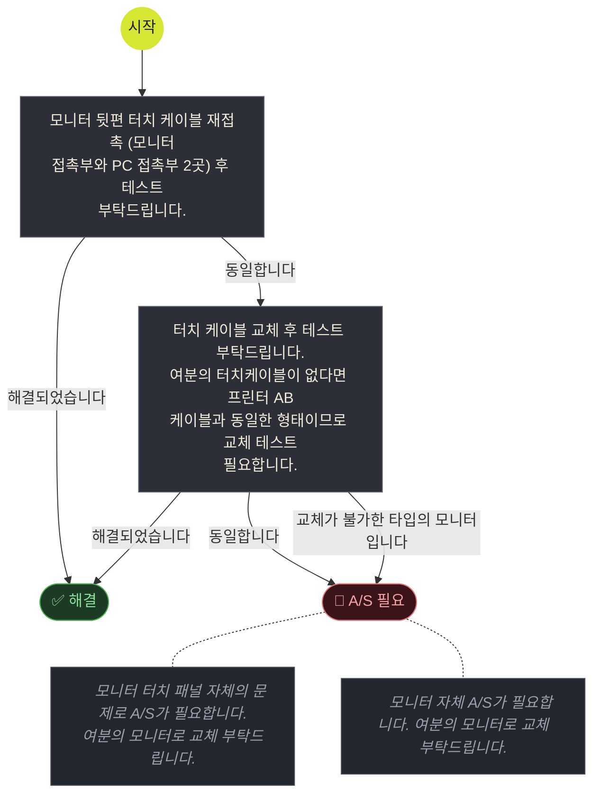


### MON-3 · 화면 송출이 비정상적인 증상

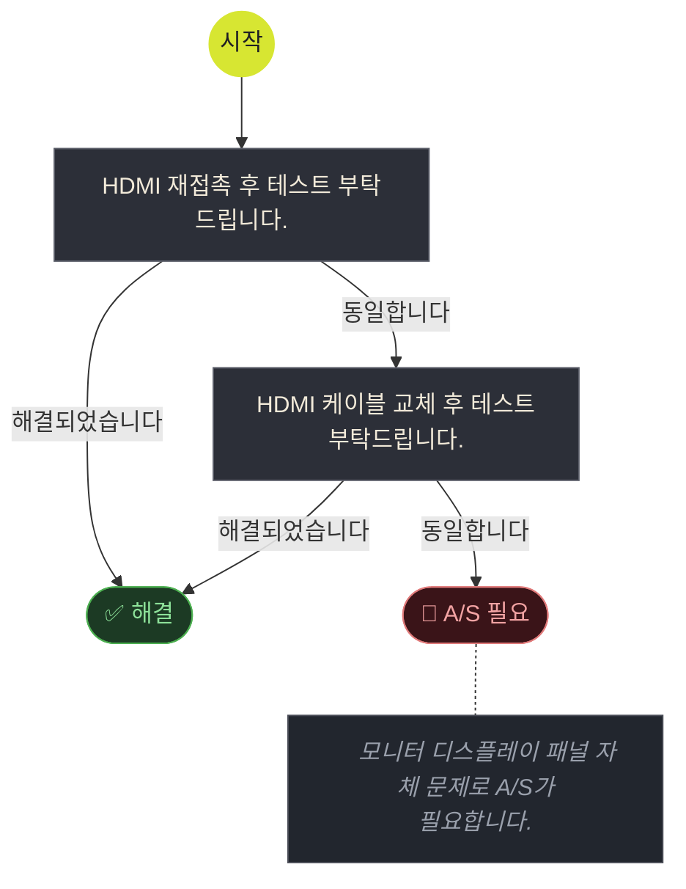


## 🖨️ 프린터


### PRT-1 · 리본오류 문구 발생


### PRT-2 · 헤드위치 오류 문구 발생


### PRT-8 · 커터오류 문구 발생


### PRT-3 · 전원 차단 문구 발생

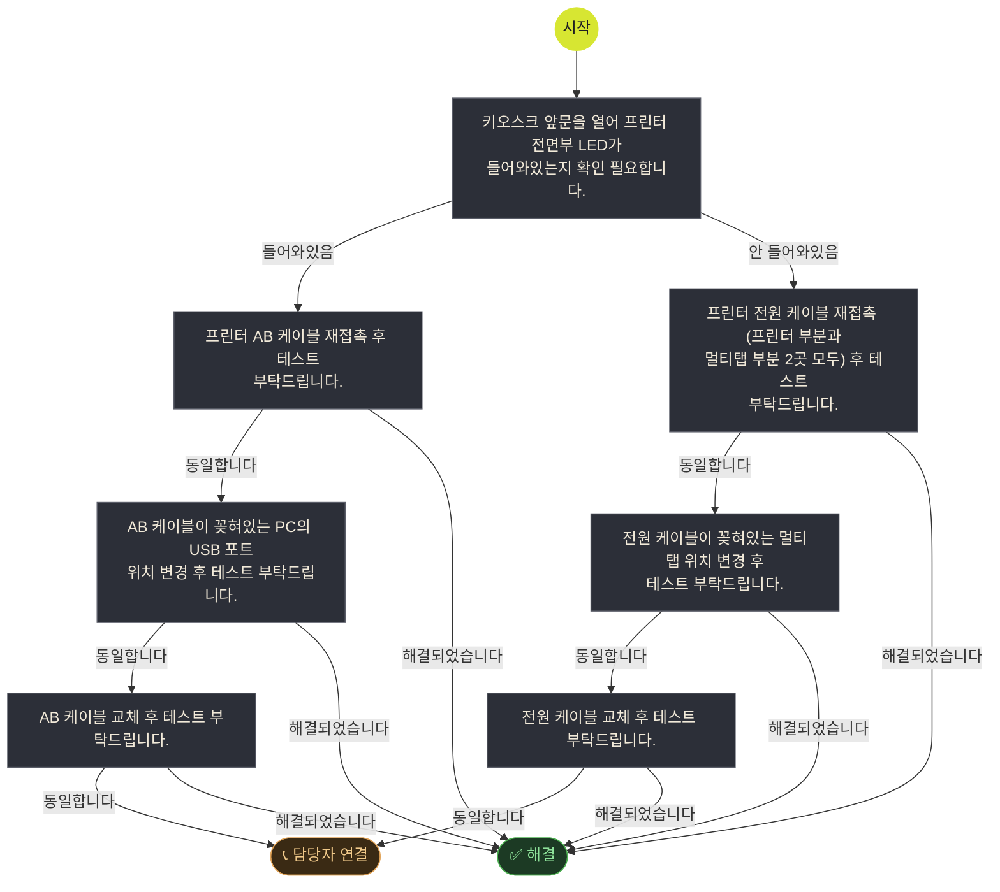


### PRT-4 · 냉각팬 오류 문구 발생

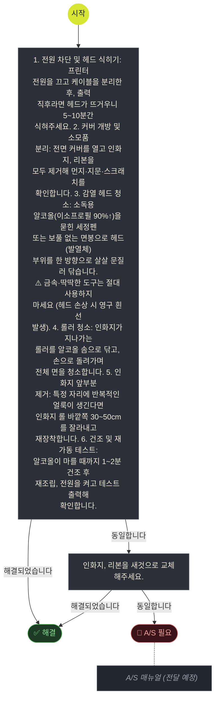


### PRT-5 · 출력물에 얼룩/점 발생

```mermaid
flowchart TD
  START(("시작")) --> n1
  n1["1. 전원 차단 및 헤드 식히기: 프린터<br/>전원을 끄고 케이블을 분리한 후, 출력<br/>직후라면 헤드가 뜨거우니 5~10분간<br/>식혀주세요. 2. 커버 개방 및 소모품<br/>분리: 전면 커버를 열고 인화지, 리본을<br/>모두 제거해 먼지·지문·스크래치를<br/>확인합니다. 3. 감열 헤드 청소: 소독용<br/>알코올(이소프로필 90%↑)을 묻힌 세정펜<br/>또는 보풀 없는 면봉으로 헤드(발열체)<br/>부위를 한 방향으로 살살 문질러 닦습니다.<br/>⚠️ 금속·딱딱한 도구는 절대 사용하지<br/>마세요 (헤드 손상 시 영구 흰 선<br/>발생). 4. 롤러 청소: 인화지가 지나가는<br/>롤러를 알코올 솜으로 닦고, 손으로 돌려가며<br/>전체 면을 청소합니다. 5. 인화지 앞부분<br/>제거: 특정 자리에 반복적인 얼룩이 생긴다면<br/>인화지 롤 바깥쪽 30~50cm를 잘라내고<br/>재장착합니다. 6. 건조 및 재가동 테스트:<br/>알코올이 마를 때까지 1~2분 건조 후<br/>재조립, 전원을 켜고 테스트 출력해<br/>확인합니다."]
  n2["인화지, 리본을 새것으로 교체해주세요."]
  END_SOLVED(["✅ 해결"])
  n1 -->|해결되었습니다| END_SOLVED
  n1 -->|동일합니다| n2
  n2 -->|해결되었습니다| END_SOLVED
  END_AS(["🔧 A/S 필요"])
  n2 -->|동일합니다| END_AS
  NOTE_n2_1["📝 📎 A/S 매뉴얼 (전달 예정)"]
  END_AS -.- NOTE_n2_1
  class NOTE_n2_1 noteNode
  classDef default fill:#2c2f38,stroke:#5a5d68,color:#f2ead9,stroke-width:1px
  classDef jumpNode fill:#3a3d1c,stroke:#d7e632,color:#d7e632
  classDef noteNode fill:#22262e,stroke:#4a4d57,color:#9aa0ac,font-style:italic
  style END_SOLVED fill:#1c3a24,stroke:#4caf50,color:#8ee29a
  style END_AS fill:#3a1418,stroke:#e07a7a,color:#f2a3a3
  style START fill:#d7e632,stroke:#d7e632,color:#1f1f23
```


### PRT-6 · 소모품(인화지·리본) 구겨짐/끊어짐

```mermaid
flowchart TD
  START(("시작")) --> n1
  n1["1. 전원 차단 및 헤드 식히기: 프린터<br/>전원을 끄고 케이블을 분리한 후, 출력<br/>직후라면 헤드가 뜨거우니 5~10분간<br/>식혀주세요. 2. 커버 개방 및 소모품<br/>분리: 전면 커버를 열고 인화지, 리본을<br/>모두 제거해 먼지·지문·스크래치를<br/>확인합니다. 3. 감열 헤드 청소: 소독용<br/>알코올(이소프로필 90%↑)을 묻힌 세정펜<br/>또는 보풀 없는 면봉으로 헤드(발열체)<br/>부위를 한 방향으로 살살 문질러 닦습니다.<br/>⚠️ 금속·딱딱한 도구는 절대 사용하지<br/>마세요 (헤드 손상 시 영구 흰 선<br/>발생). 4. 롤러 청소: 인화지가 지나가는<br/>롤러를 알코올 솜으로 닦고, 손으로 돌려가며<br/>전체 면을 청소합니다. 5. 인화지 앞부분<br/>제거: 특정 자리에 반복적인 얼룩이 생긴다면<br/>인화지 롤 바깥쪽 30~50cm를 잘라내고<br/>재장착합니다. 6. 건조 및 재가동 테스트:<br/>알코올이 마를 때까지 1~2분 건조 후<br/>재조립, 전원을 켜고 테스트 출력해<br/>확인합니다."]
  n2["인화지, 리본을 새것으로 교체해주세요."]
  END_SOLVED(["✅ 해결"])
  n1 -->|해결되었습니다| END_SOLVED
  n1 -->|동일합니다| n2
  n2 -->|해결되었습니다| END_SOLVED
  END_AS(["🔧 A/S 필요"])
  n2 -->|동일합니다| END_AS
  NOTE_n2_1["📝 📎 A/S 매뉴얼 (전달 예정)"]
  END_AS -.- NOTE_n2_1
  class NOTE_n2_1 noteNode
  classDef default fill:#2c2f38,stroke:#5a5d68,color:#f2ead9,stroke-width:1px
  classDef jumpNode fill:#3a3d1c,stroke:#d7e632,color:#d7e632
  classDef noteNode fill:#22262e,stroke:#4a4d57,color:#9aa0ac,font-style:italic
  style END_SOLVED fill:#1c3a24,stroke:#4caf50,color:#8ee29a
  style END_AS fill:#3a1418,stroke:#e07a7a,color:#f2a3a3
  style START fill:#d7e632,stroke:#d7e632,color:#1f1f23
```


### PRT-7 · 사진 출력 시 QR이 안 나오는 증상

```mermaid
flowchart TD
  START(("시작")) --> n1
  n1["PC 부분 랜선과 매장 벽포트에 접촉되어<br/>있는 랜선, 두 곳 모두 재접촉 후 PC<br/>재부팅 및 테스트 부탁드립니다."]
  n2["랜선 교체 후 테스트 부탁드립니다."]
  END_SOLVED(["✅ 해결"])
  n1 -->|해결되었습니다| END_SOLVED
  n1 -->|동일합니다| n2
  n2 -->|해결되었습니다| END_SOLVED
  END_ESCALATE(["📞 담당자 연결"])
  n2 -->|동일합니다| END_ESCALATE
  NOTE_n2_1["📝 인터넷 기사를 호출하여 해당 부스의 인터넷 연결 상태<br/>확인이 필요합니다."]
  END_ESCALATE -.- NOTE_n2_1
  class NOTE_n2_1 noteNode
  classDef default fill:#2c2f38,stroke:#5a5d68,color:#f2ead9,stroke-width:1px
  classDef jumpNode fill:#3a3d1c,stroke:#d7e632,color:#d7e632
  classDef noteNode fill:#22262e,stroke:#4a4d57,color:#9aa0ac,font-style:italic
  style END_SOLVED fill:#1c3a24,stroke:#4caf50,color:#8ee29a
  style END_ESCALATE fill:#3a2a14,stroke:#e0a256,color:#f0c98a
  style START fill:#d7e632,stroke:#d7e632,color:#1f1f23
```


### PRT-9 · 출력물 흰색 여백 발생

```mermaid
flowchart TD
  START(("시작")) --> n1
  n1["이 증상에 대한 조치 방법은 곧 채워질<br/>예정이에요. 우선 담당자에게 문의해주세요."]
  END_ESCALATE(["📞 담당자 연결"])
  n1 -->|확인했습니다| END_ESCALATE
  classDef default fill:#2c2f38,stroke:#5a5d68,color:#f2ead9,stroke-width:1px
  classDef jumpNode fill:#3a3d1c,stroke:#d7e632,color:#d7e632
  classDef noteNode fill:#22262e,stroke:#4a4d57,color:#9aa0ac,font-style:italic
  style END_ESCALATE fill:#3a2a14,stroke:#e0a256,color:#f0c98a
  style START fill:#d7e632,stroke:#d7e632,color:#1f1f23
```


### PRT-10 · 리본 끊어진 증상

```mermaid
flowchart TD
  START(("시작")) --> n1
  n1["이 증상에 대한 조치 방법은 곧 채워질<br/>예정이에요. 우선 담당자에게 문의해주세요."]
  END_ESCALATE(["📞 담당자 연결"])
  n1 -->|확인했습니다| END_ESCALATE
  classDef default fill:#2c2f38,stroke:#5a5d68,color:#f2ead9,stroke-width:1px
  classDef jumpNode fill:#3a3d1c,stroke:#d7e632,color:#d7e632
  classDef noteNode fill:#22262e,stroke:#4a4d57,color:#9aa0ac,font-style:italic
  style END_ESCALATE fill:#3a2a14,stroke:#e0a256,color:#f0c98a
  style START fill:#d7e632,stroke:#d7e632,color:#1f1f23
```


### PRT-11 · QR인식 불가

```mermaid
flowchart TD
  START(("시작")) --> n1
  n1["이 증상에 대한 조치 방법은 곧 채워질<br/>예정이에요. 우선 담당자에게 문의해주세요."]
  END_ESCALATE(["📞 담당자 연결"])
  n1 -->|확인했습니다| END_ESCALATE
  classDef default fill:#2c2f38,stroke:#5a5d68,color:#f2ead9,stroke-width:1px
  classDef jumpNode fill:#3a3d1c,stroke:#d7e632,color:#d7e632
  classDef noteNode fill:#22262e,stroke:#4a4d57,color:#9aa0ac,font-style:italic
  style END_ESCALATE fill:#3a2a14,stroke:#e0a256,color:#f0c98a
  style START fill:#d7e632,stroke:#d7e632,color:#1f1f23
```


### PRT-12 · QR코드 기간 만료

```mermaid
flowchart TD
  START(("시작")) --> n1
  n1["이 증상에 대한 조치 방법은 곧 채워질<br/>예정이에요. 우선 담당자에게 문의해주세요."]
  END_ESCALATE(["📞 담당자 연결"])
  n1 -->|확인했습니다| END_ESCALATE
  classDef default fill:#2c2f38,stroke:#5a5d68,color:#f2ead9,stroke-width:1px
  classDef jumpNode fill:#3a3d1c,stroke:#d7e632,color:#d7e632
  classDef noteNode fill:#22262e,stroke:#4a4d57,color:#9aa0ac,font-style:italic
  style END_ESCALATE fill:#3a2a14,stroke:#e0a256,color:#f0c98a
  style START fill:#d7e632,stroke:#d7e632,color:#1f1f23
```


### PRT-13 · QR코드 미출력

```mermaid
flowchart TD
  START(("시작")) --> n1
  n1["이 증상에 대한 조치 방법은 곧 채워질<br/>예정이에요. 우선 담당자에게 문의해주세요."]
  END_ESCALATE(["📞 담당자 연결"])
  n1 -->|확인했습니다| END_ESCALATE
  classDef default fill:#2c2f38,stroke:#5a5d68,color:#f2ead9,stroke-width:1px
  classDef jumpNode fill:#3a3d1c,stroke:#d7e632,color:#d7e632
  classDef noteNode fill:#22262e,stroke:#4a4d57,color:#9aa0ac,font-style:italic
  style END_ESCALATE fill:#3a2a14,stroke:#e0a256,color:#f0c98a
  style START fill:#d7e632,stroke:#d7e632,color:#1f1f23
```


### PRT-14 · QR코드 잘림

```mermaid
flowchart TD
  START(("시작")) --> n1
  n1["이 증상에 대한 조치 방법은 곧 채워질<br/>예정이에요. 우선 담당자에게 문의해주세요."]
  END_ESCALATE(["📞 담당자 연결"])
  n1 -->|확인했습니다| END_ESCALATE
  classDef default fill:#2c2f38,stroke:#5a5d68,color:#f2ead9,stroke-width:1px
  classDef jumpNode fill:#3a3d1c,stroke:#d7e632,color:#d7e632
  classDef noteNode fill:#22262e,stroke:#4a4d57,color:#9aa0ac,font-style:italic
  style END_ESCALATE fill:#3a2a14,stroke:#e0a256,color:#f0c98a
  style START fill:#d7e632,stroke:#d7e632,color:#1f1f23
```


## 💻 PC


### PC-1 · 부팅이 안되는 증상

```mermaid
flowchart TD
  START(("시작")) --> n1
  n1["PC 전원 케이블 재접촉 후 테스트<br/>부탁드립니다."]
  n2["PC 전원 스위치가 ㅡ 자에 향해 있나요?"]
  n3a["전원케이블이 꽂힌 멀티탭 위치 변경 후<br/>테스트 부탁드립니다."]
  n4["전원케이블 교체 후 테스트 부탁드립니다."]
  n3b["전원 스위치를 ㅡ 자로 위치시킨 후 테스트<br/>부탁드립니다."]
  END_SOLVED(["✅ 해결"])
  n1 -->|해결되었습니다| END_SOLVED
  n1 -->|동일합니다| n2
  n2 -->|네| n3a
  n2 -->|아니오| n3b
  n3a -->|해결되었습니다| END_SOLVED
  n3a -->|동일합니다| n4
  n4 -->|해결되었습니다| END_SOLVED
  END_AS(["🔧 A/S 필요"])
  n4 -->|동일합니다| END_AS
  NOTE_n4_1["📝 PC 내부 부품 문제로 A/S가 필요합니다."]
  END_AS -.- NOTE_n4_1
  class NOTE_n4_1 noteNode
  n3b -->|해결되었습니다| END_SOLVED
  n3b -->|동일합니다| n3a
  classDef default fill:#2c2f38,stroke:#5a5d68,color:#f2ead9,stroke-width:1px
  classDef jumpNode fill:#3a3d1c,stroke:#d7e632,color:#d7e632
  classDef noteNode fill:#22262e,stroke:#4a4d57,color:#9aa0ac,font-style:italic
  style END_SOLVED fill:#1c3a24,stroke:#4caf50,color:#8ee29a
  style END_AS fill:#3a1418,stroke:#e07a7a,color:#f2a3a3
  style START fill:#d7e632,stroke:#d7e632,color:#1f1f23
```


### PC-2 · 블루스크린 발생

```mermaid
flowchart TD
  START(("시작")) --> n1
  n1["PC 재부팅 후 테스트 부탁드립니다."]
  END_SOLVED(["✅ 해결"])
  n1 -->|해결되었습니다| END_SOLVED
  END_AS(["🔧 A/S 필요"])
  n1 -->|동일합니다| END_AS
  NOTE_n1_1["📝 📎 A/S 매뉴얼 (전달 예정)"]
  END_AS -.- NOTE_n1_1
  class NOTE_n1_1 noteNode
  classDef default fill:#2c2f38,stroke:#5a5d68,color:#f2ead9,stroke-width:1px
  classDef jumpNode fill:#3a3d1c,stroke:#d7e632,color:#d7e632
  classDef noteNode fill:#22262e,stroke:#4a4d57,color:#9aa0ac,font-style:italic
  style END_SOLVED fill:#1c3a24,stroke:#4caf50,color:#8ee29a
  style END_AS fill:#3a1418,stroke:#e07a7a,color:#f2a3a3
  style START fill:#d7e632,stroke:#d7e632,color:#1f1f23
```


### PC-3 · 용량 부족

```mermaid
flowchart TD
  START(("시작")) --> n1
  n1["이 증상에 대한 조치 방법은 곧 채워질<br/>예정이에요. 우선 담당자에게 문의해주세요."]
  END_ESCALATE(["📞 담당자 연결"])
  n1 -->|확인했습니다| END_ESCALATE
  classDef default fill:#2c2f38,stroke:#5a5d68,color:#f2ead9,stroke-width:1px
  classDef jumpNode fill:#3a3d1c,stroke:#d7e632,color:#d7e632
  classDef noteNode fill:#22262e,stroke:#4a4d57,color:#9aa0ac,font-style:italic
  style END_ESCALATE fill:#3a2a14,stroke:#e0a256,color:#f0c98a
  style START fill:#d7e632,stroke:#d7e632,color:#1f1f23
```


## 💳 카드리더기


### CR-1 · 카드 결제 실패

```mermaid
flowchart TD
  START(("시작")) --> n1
  n1["카드리더기 전면부에 LED가 들어와있을까요?"]
  n2a["카드리더기 전면부의 IC 칩을 제거 후 다시<br/>재장착해주세요."]
  n2b["PC에 접촉되어 있는 카드리더기 케이블을<br/>재접촉해주세요."]
  n1 -->|네| n2a
  n1 -->|아니오| n2b
  END_SOLVED(["✅ 해결"])
  n2a -->|해결되었습니다| END_SOLVED
  n2a -->|동일합니다| n2b
  n2b -->|해결되었습니다| END_SOLVED
  END_ESCALATE(["📞 담당자 연결"])
  n2b -->|동일합니다| END_ESCALATE
  classDef default fill:#2c2f38,stroke:#5a5d68,color:#f2ead9,stroke-width:1px
  classDef jumpNode fill:#3a3d1c,stroke:#d7e632,color:#d7e632
  classDef noteNode fill:#22262e,stroke:#4a4d57,color:#9aa0ac,font-style:italic
  style END_SOLVED fill:#1c3a24,stroke:#4caf50,color:#8ee29a
  style END_ESCALATE fill:#3a2a14,stroke:#e0a256,color:#f0c98a
  style START fill:#d7e632,stroke:#d7e632,color:#1f1f23
```


### CR-2 · 카드 결제수단 선택불가

```mermaid
flowchart TD
  START(("시작")) --> n1
  n1["PC 부분 랜선과 매장 벽포트에 접촉되어<br/>있는 랜선, 두 곳 모두 재접촉 후 PC<br/>재부팅 및 테스트 부탁드립니다."]
  n2["랜선 교체 후 테스트 부탁드립니다."]
  END_SOLVED(["✅ 해결"])
  n1 -->|해결되었습니다| END_SOLVED
  n1 -->|동일합니다| n2
  n2 -->|해결되었습니다| END_SOLVED
  END_ESCALATE(["📞 담당자 연결"])
  n2 -->|동일합니다| END_ESCALATE
  NOTE_n2_1["📝 인터넷 기사를 호출하여 해당 부스의 인터넷 연결 상태<br/>확인이 필요합니다."]
  END_ESCALATE -.- NOTE_n2_1
  class NOTE_n2_1 noteNode
  classDef default fill:#2c2f38,stroke:#5a5d68,color:#f2ead9,stroke-width:1px
  classDef jumpNode fill:#3a3d1c,stroke:#d7e632,color:#d7e632
  classDef noteNode fill:#22262e,stroke:#4a4d57,color:#9aa0ac,font-style:italic
  style END_SOLVED fill:#1c3a24,stroke:#4caf50,color:#8ee29a
  style END_ESCALATE fill:#3a2a14,stroke:#e0a256,color:#f0c98a
  style START fill:#d7e632,stroke:#d7e632,color:#1f1f23
```


## 💵 지폐투입기


### BILL-1 · 지폐 투입 불가

```mermaid
flowchart TD
  START(("시작")) --> n1
  n1["지폐투입기에 LED가 들어와있을까요?"]
  n2a["지폐투입기 상부 커버를 열었을 때 레일이<br/>돌아가면서 소리가 나나요?"]
  n3a["레일을 수동으로 돌려가면서 이물질이 있는지<br/>확인하고, 마른 천을 이용하여 청소 및<br/>테스트해주세요."]
  n2b["지폐투입기 측면에 있는 케이블과, 그<br/>반대쪽인 멀티탭과 PC 부분 or I/O<br/>보드 기판 부분을 재접촉 후 LED가<br/>들어오는지 확인해주세요."]
  n3b["지폐투입기 또는 지폐투입기 케이블을 교체하여<br/>테스트해주세요. 여분이 없다면 정상 작동하는<br/>부스의 지폐투입기 혹은 케이블을 가져와<br/>테스트해주세요. 교체 항목에 따라 조치되는<br/>것을 보고 어떤 것이 불량인지 확인해주세요."]
  n1 -->|네| n2a
  n1 -->|아니요| n2b
  END_ESCALATE(["📞 담당자 연결"])
  n2a -->|네| END_ESCALATE
  n2a -->|아니요| n3a
  END_SOLVED(["✅ 해결"])
  n3a -->|해결되었습니다| END_SOLVED
  n3a -->|동일합니다| END_ESCALATE
  n2b -->|해결되었습니다| END_SOLVED
  n2b -->|동일합니다| n3b
  n3b -->|지폐투입기 교체로 해결되었습니다| END_SOLVED
  NOTE_n3b_0["📝 지폐투입기 불량으로 확인되었습니다."]
  END_SOLVED -.- NOTE_n3b_0
  class NOTE_n3b_0 noteNode
  n3b -->|케이블 교체로 해결되었습니다| END_SOLVED
  NOTE_n3b_1["📝 케이블 불량으로 확인되었습니다."]
  END_SOLVED -.- NOTE_n3b_1
  class NOTE_n3b_1 noteNode
  classDef default fill:#2c2f38,stroke:#5a5d68,color:#f2ead9,stroke-width:1px
  classDef jumpNode fill:#3a3d1c,stroke:#d7e632,color:#d7e632
  classDef noteNode fill:#22262e,stroke:#4a4d57,color:#9aa0ac,font-style:italic
  style END_SOLVED fill:#1c3a24,stroke:#4caf50,color:#8ee29a
  style END_ESCALATE fill:#3a2a14,stroke:#e0a256,color:#f0c98a
  style START fill:#d7e632,stroke:#d7e632,color:#1f1f23
```


### BILL-3 · 지폐 투입은 되나 인식이 안되는 증상

```mermaid
flowchart TD
  START(("시작")) --> n1
  n1["투입은 정상이나 화면상 인식이 안 되는<br/>증상입니다."]
  END_ESCALATE(["📞 담당자 연결"])
  n1 -->|확인했습니다| END_ESCALATE
  classDef default fill:#2c2f38,stroke:#5a5d68,color:#f2ead9,stroke-width:1px
  classDef jumpNode fill:#3a3d1c,stroke:#d7e632,color:#d7e632
  classDef noteNode fill:#22262e,stroke:#4a4d57,color:#9aa0ac,font-style:italic
  style END_ESCALATE fill:#3a2a14,stroke:#e0a256,color:#f0c98a
  style START fill:#d7e632,stroke:#d7e632,color:#1f1f23
```


### BILL-4 · 지폐 or 카드 걸림

```mermaid
flowchart TD
  START(("시작")) --> n1
  n1["이 증상에 대한 조치 방법은 곧 채워질<br/>예정이에요. 우선 담당자에게 문의해주세요."]
  END_ESCALATE(["📞 담당자 연결"])
  n1 -->|확인했습니다| END_ESCALATE
  classDef default fill:#2c2f38,stroke:#5a5d68,color:#f2ead9,stroke-width:1px
  classDef jumpNode fill:#3a3d1c,stroke:#d7e632,color:#d7e632
  classDef noteNode fill:#22262e,stroke:#4a4d57,color:#9aa0ac,font-style:italic
  style END_ESCALATE fill:#3a2a14,stroke:#e0a256,color:#f0c98a
  style START fill:#d7e632,stroke:#d7e632,color:#1f1f23
```


## 🎮 리모컨 / 서비스코인 / 설정


### RC-1 · 리모컨 작동 불가

```mermaid
flowchart TD
  START(("시작")) --> n1
  n1["키오스크 뒷문을 열어 좌측을 보면 리모컨이<br/>빠져있는 구멍이 있습니다. 그 선을 따라가면<br/>체결부가 있는데, 거기 재접촉 해서<br/>작동되는지 테스트해주세요."]
  n2["이 키오스크는 I/O보드를 사용하는<br/>타입인가요?"]
  n3a["서비스코인, 설정버튼이 작동되나요?"]
  n4a["리모컨 교체 후 테스트해주세요."]
  n5a["리모컨 연장케이블 교체 후 테스트해주세요."]
  n3b["서비스코인, 설정버튼이 작동되나요?"]
  n4b["리모컨 교체 후 테스트해주세요."]
  n4c["PC에 꽂혀있는 USB 커넥터<br/>케이블(setting/coin 네임택)<br/>재접촉 후 테스트해주세요."]
  n5c["USB 커넥터 케이블 교체 후<br/>테스트해주세요."]
  END_SOLVED(["✅ 해결"])
  n1 -->|해결되었습니다| END_SOLVED
  n1 -->|동일합니다| n2
  n2 -->|예, I/O보드형| n3a
  n2 -->|아니오, 최신형 (USB커넥터 통합)| n3b
  END_ESCALATE(["📞 담당자 연결"])
  n3a -->|작동 안 함| END_ESCALATE
  NOTE_n3a_0["📝 I/O보드 문제로 판단됩니다. TX팀 소통에 따라 조치<br/>방법을 안내받아야 합니다."]
  END_ESCALATE -.- NOTE_n3a_0
  class NOTE_n3a_0 noteNode
  n3a -->|작동함| n4a
  n4a -->|해결되었습니다| END_SOLVED
  n4a -->|동일합니다| n5a
  n5a -->|해결되었습니다| END_SOLVED
  n5a -->|동일합니다| END_ESCALATE
  n3b -->|작동함| n4b
  n3b -->|작동 안 함| n4c
  n4b -->|해결되었습니다| END_SOLVED
  n4b -->|동일합니다| END_ESCALATE
  n4c -->|해결되었습니다| END_SOLVED
  n4c -->|동일합니다| n5c
  n5c -->|해결되었습니다| END_SOLVED
  n5c -->|동일합니다| END_ESCALATE
  classDef default fill:#2c2f38,stroke:#5a5d68,color:#f2ead9,stroke-width:1px
  classDef jumpNode fill:#3a3d1c,stroke:#d7e632,color:#d7e632
  classDef noteNode fill:#22262e,stroke:#4a4d57,color:#9aa0ac,font-style:italic
  style END_SOLVED fill:#1c3a24,stroke:#4caf50,color:#8ee29a
  style END_ESCALATE fill:#3a2a14,stroke:#e0a256,color:#f0c98a
  style START fill:#d7e632,stroke:#d7e632,color:#1f1f23
```


### RC-2 · 서비스코인/설정버튼 작동 불가

```mermaid
flowchart TD
  START(("시작")) --> n1
  n1["I/O보드 접촉부 쪽 케이블 재접촉 후<br/>테스트해주세요."]
  n2["이 키오스크는 I/O보드를 사용하는<br/>타입인가요?"]
  n3a["리모컨은 작동되나요?"]
  n4a["서비스코인/설정버튼 자체 교체는 어려우므로,<br/>USB 커넥터 케이블 방식으로 교체해주세요."]
  n3b["리모컨은 작동되나요?"]
  n4b["USB 커넥터 케이블(setting/coin<br/>네임택) 재접촉 후 테스트해주세요."]
  n5b["USB 커넥터 케이블 교체 후<br/>테스트해주세요."]
  n4c["USB 커넥터 케이블 재접촉 후<br/>테스트해주세요."]
  n5c["USB 커넥터 케이블 교체 후<br/>테스트해주세요."]
  END_SOLVED(["✅ 해결"])
  n1 -->|해결되었습니다| END_SOLVED
  n1 -->|동일합니다| n2
  n2 -->|예, I/O보드형| n3a
  n2 -->|아니오, 최신형 (USB커넥터 통합)| n3b
  END_ESCALATE(["📞 담당자 연결"])
  n3a -->|작동 안 함| END_ESCALATE
  NOTE_n3a_0["📝 I/O보드 문제로 판단됩니다."]
  END_ESCALATE -.- NOTE_n3a_0
  class NOTE_n3a_0 noteNode
  n3a -->|작동함| n4a
  n4a -->|해결되었습니다| END_SOLVED
  n4a -->|동일합니다| END_ESCALATE
  n3b -->|작동함| n4b
  n3b -->|작동 안 함| n4c
  n4b -->|해결되었습니다| END_SOLVED
  n4b -->|동일합니다| n5b
  n5b -->|해결되었습니다| END_SOLVED
  n5b -->|동일합니다| END_ESCALATE
  n4c -->|해결되었습니다| END_SOLVED
  n4c -->|동일합니다| n5c
  n5c -->|해결되었습니다| END_SOLVED
  n5c -->|동일합니다| END_ESCALATE
  classDef default fill:#2c2f38,stroke:#5a5d68,color:#f2ead9,stroke-width:1px
  classDef jumpNode fill:#3a3d1c,stroke:#d7e632,color:#d7e632
  classDef noteNode fill:#22262e,stroke:#4a4d57,color:#9aa0ac,font-style:italic
  style END_SOLVED fill:#1c3a24,stroke:#4caf50,color:#8ee29a
  style END_ESCALATE fill:#3a2a14,stroke:#e0a256,color:#f0c98a
  style START fill:#d7e632,stroke:#d7e632,color:#1f1f23
```


## 🛰️ CMS


### CMS-1 · CMS 잔여용지가 -1로 표시됨

```mermaid
flowchart TD
  START(("시작")) --> n1
  n1["PC 부분 랜선과 매장 벽포트에 접촉되어<br/>있는 랜선, 두 곳 모두 재접촉 후 PC<br/>재부팅 및 테스트 부탁드립니다."]
  n2["랜선 교체 후 테스트 부탁드립니다."]
  END_SOLVED(["✅ 해결"])
  n1 -->|해결되었습니다| END_SOLVED
  n1 -->|동일합니다| n2
  n2 -->|해결되었습니다| END_SOLVED
  END_ESCALATE(["📞 담당자 연결"])
  n2 -->|동일합니다| END_ESCALATE
  NOTE_n2_1["📝 인터넷 기사를 호출하여 해당 부스의 인터넷 연결 상태<br/>확인이 필요합니다."]
  END_ESCALATE -.- NOTE_n2_1
  class NOTE_n2_1 noteNode
  classDef default fill:#2c2f38,stroke:#5a5d68,color:#f2ead9,stroke-width:1px
  classDef jumpNode fill:#3a3d1c,stroke:#d7e632,color:#d7e632
  classDef noteNode fill:#22262e,stroke:#4a4d57,color:#9aa0ac,font-style:italic
  style END_SOLVED fill:#1c3a24,stroke:#4caf50,color:#8ee29a
  style END_ESCALATE fill:#3a2a14,stroke:#e0a256,color:#f0c98a
  style START fill:#d7e632,stroke:#d7e632,color:#1f1f23
```


## 🪙 서비스코인


### SNAP-COIN-1 · 서비스코인/설정버튼 작동 불가

```mermaid
flowchart TD
  START(("시작")) --> n1
  n1["USB 커넥터 케이블(setting/coin<br/>네임택) 재접촉 후 테스트해주세요."]
  n2["USB 커넥터 케이블 교체 후<br/>테스트해주세요."]
  END_SOLVED(["✅ 해결"])
  n1 -->|해결되었습니다| END_SOLVED
  n1 -->|동일합니다| n2
  n2 -->|해결되었습니다| END_SOLVED
  END_ESCALATE(["📞 담당자 연결"])
  n2 -->|동일합니다| END_ESCALATE
  classDef default fill:#2c2f38,stroke:#5a5d68,color:#f2ead9,stroke-width:1px
  classDef jumpNode fill:#3a3d1c,stroke:#d7e632,color:#d7e632
  classDef noteNode fill:#22262e,stroke:#4a4d57,color:#9aa0ac,font-style:italic
  style END_SOLVED fill:#1c3a24,stroke:#4caf50,color:#8ee29a
  style END_ESCALATE fill:#3a2a14,stroke:#e0a256,color:#f0c98a
  style START fill:#d7e632,stroke:#d7e632,color:#1f1f23
```
